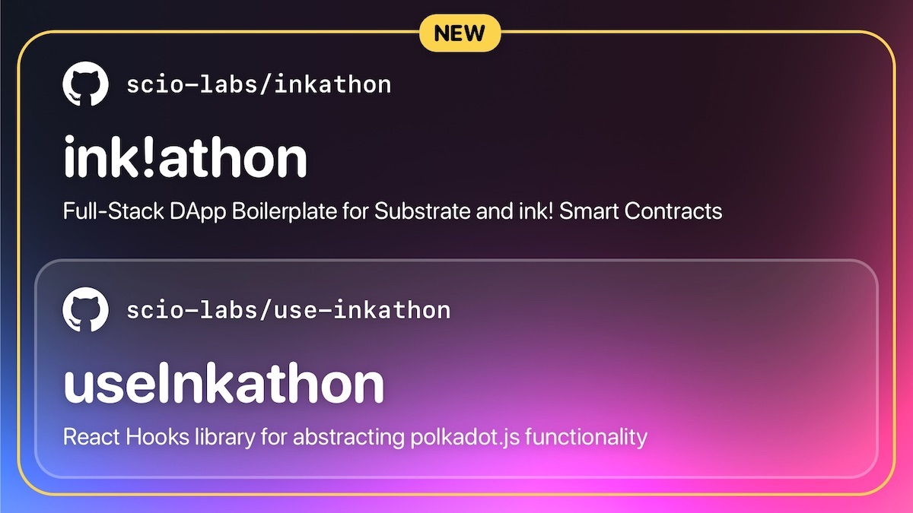

# Aleph Blog

---

## Inspiration

Recently, we've seen that AZERO.Id was released on the mainnet just one week ago, and we were inspired to leverage this new decentralized domain system to create a solution for resolving user profiles, enabling a censorship-resistant writing protocol.

## What it does

Our protocol and dApp allow users to create customized writer's profiles, compose articles or short posts, upload them to Arweave, and share them via smart contracts. Readers can also financially support their favorite creators through donations.

## How we built it

- Smart contracts were created using Ink and the Ink CLI.
- Frontend was developed using NEXT.js and the Inkathon template with UseInkathon hooks for React.

---
